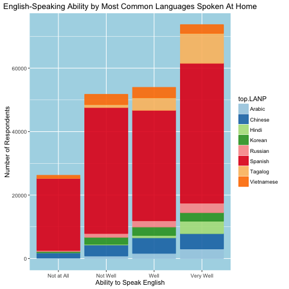

############################################
####Project of group 10
##Coming to America:
###Taking A Closer Look at Non-English-Speaking Immigrants in the American Community Survey 2013
############################################
####group members:
Joshua Michael Dillon (jmd2228)  
Schinria Islam (sri2116)  
Chenlu Ji (cj2452)  
Zhibo Wan (zw2327)  
Yuan Zhao (yz2885)  

February 3, 2016

###Overview
For our project, we had four primary motivations. First, we wanted to further understand a group of people who are vital to the success and growth of the United States: immigrants. Approximately 13% of the United States population is composed of immigrants, or nearly 41 million residents, and it is no surprise that much of our country's innovation and economic engine is fueled by the diversity of our people and ideas that come from within our borders. We wanted to take a closer look at people who currently live in the United States but were not born here, so we focus on those residents who are non-native to the United States. 

Second, we thought about the transition that many immigrants face when arriving to the US, including adapting to a new culture, climate, and set of values. One transition faced by immigrants that is captured in the American Community Survey is the transition of adopting English as a primary language. Thus, our analysis pays particular attention to the variable "ENG" which measures respondents' ability to speak English, and we restricted our analysis by these two features – non-native status and originating from a country that doesn’t have English as a primary and official language. After doing this, we used main weights (PWGTP) and found that this subpopulation of immigrants from non-English speaking countries comprises 3.7 million people, or about 1% of the U.S. population.

Third, we wanted to shed light on immigration because it is a topic that has been a highlight of much recent political discourse. As we are in a presidential election year, there has been heated debate about policies that would affect many incoming future immigrants. With the topic of immigration on many people's minds, including ours, we wanted to highlight a subgroup of our country who are extremely important to understand at this time in our history.

Lastly, we wanted to understand the respondents of the American Community Survey in particular. We realized that the individuals who complete these surveys each year make a huge impact on decisions made by local planners, policy makers, and community organizations. American Community Survey data is used by Federal Agencies,  state and local agencies, NGOs, emergency planners, businesses, educators, journalists, and the public, among other groups, and we wanted to gain a greater understanding of the respondents who completed the American Community Survey in 2013 and helped inform decisions over the last few years and gain insight into trends that may exist more broadly across the country.

Please review the [**Project File**](Team10_Presentation.Rmd) to see the whole report.
An [**Earlier Version**](old_version.Rmd) containing more figures is also retained.
To see the interactive part, please download and knirt the Rmd files or download the html files under the folder "output". 

############################################
