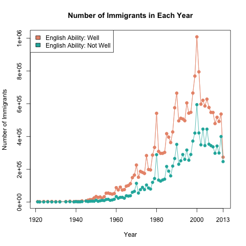
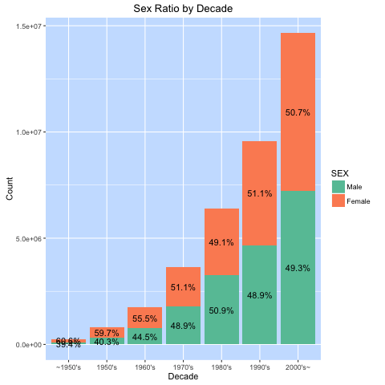
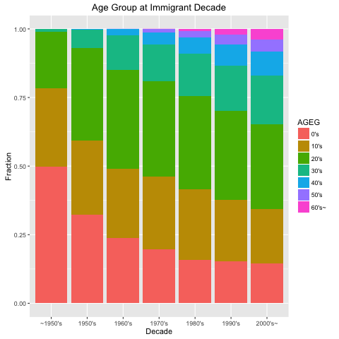
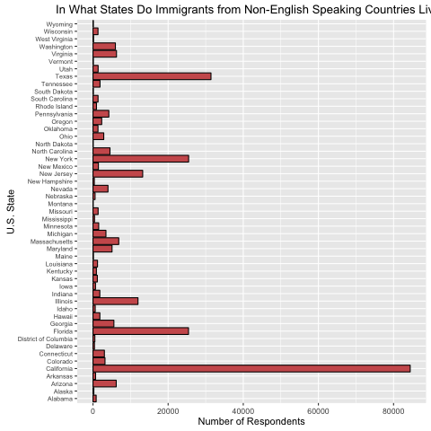
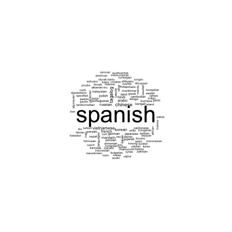
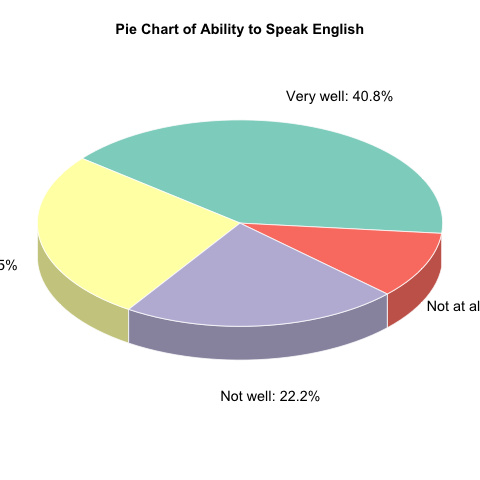

<center> <h1>Coming to America:</h1> 
<h2 style="margin-bottom: 25px;">Taking A Closer Look at Non-English-Speaking Immigrants in the American Community Survey 2013</h2> </center>
<center><h4 style="font-weight:normal">Joshua Michael Dillon, Schinria Islam, Chenlu Ji, Zhibo Wan, Yuan Zhao</h3></center>
<center><h4 style="font-weight:normal; margin-bottom: 40px;">February 3, 2016</h4></center>


<i><h2 style="color:rgba(51, 51, 51, 0.73);">Overview</h2></i>
For our project, we had four primary motivations. First, we wanted to further understand a group of people who are vital to the success and growth of the United States: immigrants. Approximately 13% of the United States population is composed of immigrants, or nearly 41 million residents, and it is no surprise that much of our country's innovation and economic engine is fueled by the diversity of our people and ideas that come from within our borders. We wanted to take a closer look at people who currently live in the United States but were not born here, so we focus on those residents who are non-native to the United States. 

Second, we thought about the transition that many immigrants face when arriving to the US, including adapting to a new culture, climate, and set of values. One transition faced by immigrants that is captured in the American Community Survey is the transition of adopting English as a primary language. Thus, our analysis pays particular attention to the variable "ENG" which measures respondents' ability to speak English. 

Third, we wanted to shed light on immigration because it is a topic that has been a highlight of much recent political discourse. As we are in a presidential election year, there has been heated debate about policies that would affect many incoming future immigrants. With the topic of immigration on many people's minds, including ours, we wanted to highlight a subgroup of our country who are extremely important to understand at this time in our history.

Lastly, we wanted to understand the respondents of the American Community Survey in particular. We realized that the individuals who complete these surveys each year make a huge impact on decisions made by local planners, policy makers, and community organizations. American Community Survey data is used by Federal Agencies,  state and local agencies, NGOs, emergency planners, businesses, educators, journalists, and the public, among other groups, and we wanted to gain a greater understanding of the respondents who completed the American Community Survey in 2013 and helped inform decisions over the last few years and gain insight into trends that may exist more broadly across the country.

```{r}


```

<i><h2 style="color:rgba(51, 51, 51, 0.73);">Setting up our Environment</h2></i>
First things first: we set up our environment to include all the packages and libraries we need for our analysis.


```{r, message=FALSE, warning=FALSE}
library(data.table)
library(plyr)
library(dplyr)
library(googleVis)
op <- options(gvis.plot.tag='chart')
library(survey)
library(ggplot2)
detach("package:plyr", unload=TRUE)
library(reshape)
library(plotrix)
library(RColorBrewer)
library(wordcloud)
library(tm)
library(SnowballC)
library(gridExtra)
```

Beginning our investigation, we wanted to know who exactly was immigrating to the United States from Non - English speaking countries? We began with a few statistics about this vital population:

<i><h2 style="color:rgba(51, 51, 51, 0.73);">Time Series of Immigration to the US</h2></i>

We separate our population into two parts: those that speak English well (responding <i>ENG = 1</i> or <i>ENG = 2</i>) and those that do not speak English well (responding <i>ENG = 3</i> or <i>ENG = 4</i>). We then counted the number of immigrants who entered the US from 1920 until 2013. The two populations had similar trends in the years of immigration. After 1960 there was a steep rise in the number of immigrants coming to the US, with peaks around 1980 and 2000.

```{r, message=FALSE, warning=FALSE, results='hide'}
source("lib/cj2452_functions.R")
population_abov <- prepare_data()
Time_Series(population_abov)
```
<p><center></center></p>


<i><h2 style="color:rgba(51, 51, 51, 0.73);">Sex Ratio by Decade</h2></i>

We were also interested in the gender ratio of the immigrants. We separated the immigration years into decades, and found that in every decade, females have been the majority of the immigrants, (except the 1980s, when male exceeded female). 

```{r, message=FALSE, warning=FALSE, results='hide'}
Sex_Decades(population_abov)
```
<p><center></center></p>

<i><h2 style="color:rgba(51, 51, 51, 0.73);">Age Group by Decade</h2></i>

Finally, we explored the ages of the men and women and children immigrating to the United States, using the <i>Age</i> and <i>Year of Entry</i> variables to make a stacked bar chart. Generally about 75% of immigrants came to the US before the age of 30, however, this is biased as there are no immigrants beyond the age of 30 in the first bar (meaning that they immigrated in the 1950s). This is because many of the people who immigrated at a later age than their 30s in the 1950s have unfortunately passed away.

```{r, message=FALSE, warning=FALSE, results='hide'}
Age_Decades(population_abov)
```
<p><center></center></p>

<i><h2 style="color:rgba(51, 51, 51, 0.73);">US States</h2></i>

Now that we have an idea of who our respondents are, we began the focus of our analysis by looking at their English speaking abilities. We wanted to get a sense of where immigrants from non-English speaking countries live in the US, by state. In order to do this, we had to first ask ourselves: which of the immigrants in our sample did not likely speak English back home? 

Using the list available on Wikipedia's page entitled <i>"List of territorial entities where English is an official language"</i> we determined which countries do not have English as their primary and official language. By doing this, we could ensure that the non-Native respondents in our sample were not expected to know English prior to immigrating to the United States. 

```{r, message=FALSE, warning=FALSE, results='hide'}
source("lib/sri2116_functions_final.R")
population <- prepare_data()
states(population)

```

The graph below shows us the current U.S. states in which the non-native respondents who completed the American Community Survey (and did not come from an English-speaking country) currently reside.

<p><center></center></p>

<i><h2 style="color:rgba(51, 51, 51, 0.73);">Primary Language Spoken at Home</h2></i>

```{r, message=FALSE, warning=FALSE, results='hide'}
popular_languages(population)
```

The wordcloud below visualizes the primary language spoken at home (excluding English) by our population of interest: non-native American Community Survey respondents who are originally from non-English speaking countries.

<p><center></center></p>

<i><h2 style="color:rgba(51, 51, 51, 0.73);">Most Common Languages Spoken at Home</h2></i>

```{r, message=FALSE, warning=FALSE, results='hide'}
common_languages(population)
```

Above we determined the top languages spoken at home, and the barplot below shows how people who speak these top languages at home vary in their ability to speak to English.

<p><center></center></p>

<i><h2 style="color:rgba(51, 51, 51, 0.73);">Immigrants' English Ability</h2></i>

```{r, message=FALSE, warning=FALSE, results='hide'}
common_states(population)
```

<i><h2 style="color:rgba(51, 51, 51, 0.73);">English Ability</h2></i>

Now that we know what languages immigrants speak in their home, lets take a general look at how they report their English speaking ability. Over 65% of people think their English is "very well"" or "well". However, approximately 11.5% of the immigrants can't speak English at all!

```{r, message=FALSE, warning=FALSE, results='hide'}
source("lib/cj2452_functions.R")
Eng_Pie(population_abov)
source("lib/sri2116_functions_final.R")
```
<p><center></center></p>

<i><h2 style="color:rgba(51, 51, 51, 0.73);">Most Common US States by English Ability</h2></i>

Previously we determined the most populous immigrant states, and we assessed their general speaking abilities. Below, this barplot shows how people who reside in these states vary in their ability to speak to English.

<p><center></center></p>

<i><h1 style="color:rgba(51, 51, 51, 0.73);">Explanatory Variables</h1></i>

<i><h2 style="color:rgba(51, 51, 51, 0.73);">Effect of Child Birth on Parent's English Ability</h2></i>
Now that we understand the languages spoken by our immigrant population, we want to explore variables that could have an affect on one's ability to speak English.

One such variable was <i>FER</i>, a binary flag that indicated whether or not a person had a children in the last twelve months. We used the variable <i>MIG</i> to narrow our population to only respondents who had moved to the United States in the past year. This would give us a look at how having, and raising, a child in the United States would affect one's English speaking ability. 


```{r, message=FALSE, warning=FALSE, results='hide'}
library("plyr")
source("lib/jmd2228_functions.R")
population <- prepare_data()
population2 <- prepare_data2()
```
```{r}
had_child_t_test(population)
```
We ran a t-test comparing the reported Englishs speaking ability of individuals who have had children vs who have not had children, and found that at the 5% significance level, those who did not have children were statistically signficantly <i>better</i> at speaking English than their parental counterparts.

In addition, this variable can be viewed graphically below, with an interactive bar chart. We see these results are consistent with our t-test, as a greater percentage of the population with no children reports better English.

```{r, results='asis',tidy=FALSE}
  # Graph stacked bar charts
  plotframe <- data.frame(ability = c("Very Well", "Well", "Not Well", "Not at all"), child = c(prop.table(table(population$children))), nochild = c(prop.table(table(population$nochildren))))

  # Plot bar chart
  chart <- gvisColumnChart(plotframe, xvar="ability", yvar=c("child", "nochild"), options=list(isStacked=TRUE, title="Parents' Ability to Speak English Stacked By Birth of Child", vAxes="[{title:'Percent of Sub Population'}]", series="[{labelInLegend: 'Child'}, {labelInLegend: 'No child'}]"))
                           
  plot(chart)
```

<i><h2 style="color:rgba(51, 51, 51, 0.73);">Child's English Ability by Parent's Nativity</h2></i>

Continuing our investigation, we wondered if the <i>nativity</i> of a child's parents (meaning whether or not they are foreign born) would affect the ability of the child to speak English. For this analysis we narrowed the population to children under the age of 18 living with their parents.

```{r, results='asis',tidy=FALSE}
  sub_pop_3 <- population2
  childframe <- data.frame(id = as.numeric(sub_pop_3$ENG), parent = as.numeric(sub_pop_3$NOP), childsize = c(rep(1,length(sub_pop_3$ENG))), fac = as.numeric(sub_pop_3$ENG))
  childframe <- na.omit(childframe)
  childframe <- aggregate(childframe$childsize, by=list(childframe$parent, childframe$id), sum)
  childframe <- data.frame(id = childframe$Group.2, parent = childframe$Group.1, childsize = childframe$x, fac = childframe$x)
  
  
  for(i in 1:dim(childframe)[1]){
    if (childframe$parent[i] == 1){
      childframe$parent[i] = "Both Native"
    } else if (childframe$parent[i] == 2){
      childframe$parent[i] = "Father Foreign"
    } else if (childframe$parent[i] == 3){
      childframe$parent[i] = "Mother Foreign"
    } else if (childframe$parent[i] == 4){
      childframe$parent[i] = "Both Foreign"
    } else if (childframe$parent[i] == 5){
      childframe$parent[i] = "Only Father, Native"
    } else if (childframe$parent[i] == 6){
      childframe$parent[i] = "Only Father, Foreign"
    } else if (childframe$parent[i] == 7){
      childframe$parent[i] = "Only Mother, Native"
    } else {
      childframe$parent[i] = "Only Mother, Foreign"
    }
    
    if (childframe$id[i] == 1){
      childframe$id[i] = paste("Very Well Count:", childframe$childsize[i])
    } else if (childframe$id[i] == 2){
      childframe$id[i] = paste("Well Count:", childframe$childsize[i])
    } else if (childframe$id[i] == 3){
      childframe$id[i] = paste("Not well Count:", childframe$childsize[i])
    } else {
      childframe$id[i] = paste("Not at all Count:", childframe$childsize[i])
    }
  }
  
  # Analysis Population 2
  childframe <- rbind(c("TOP",NA,10, 2), childframe)
  childframe <- rbind(c("Both Native","TOP",5, 4), childframe)
  childframe <- rbind(c("Father Foreign","TOP",5, 5), childframe)
  childframe <- rbind(c("Mother Foreign","TOP",5, 6), childframe)
  childframe <- rbind(c("Both Foreign","TOP",5, 7), childframe)
  childframe <- rbind(c("Only Father, Native","TOP",5, 8), childframe)
  childframe <- rbind(c("Only Father, Foreign","TOP",5, 9), childframe)
  childframe <- rbind(c("Only Mother, Native","TOP",5, 10), childframe)
  childframe <- rbind(c("Only Mother, Foreign","TOP",5, 11), childframe)
  childframe$id[36] = "Not at all Count: 9"
  
  tree <- gvisTreeMap(childframe,  idvar="id", parentvar="parent", sizevar="childsize", colorvar="fac", options=list(minColor='#EDF8FB',midColor='#66C2A4',maxColor='#006D2C'))
  plot(tree)
```

As we see in the tree plot above, regardless of nativity, these children self-reported an overwhelming ability to speak English "Very Well", which is not too unsurprising, given that they are most likely in the American school system.


## Wage and Ancestry
We all know that people are generally heavilly influenced by their older generations,interms of personality,education,and the way their live. Currently, I am looking at how the ancestry from different countries effect their younger generation's wage. First, let's look at the wage with out considering then ancestry country:   

---
```{r,message=FALSE, warning=FALSE}

source("lib/zw2327_functions.R")
pus=prepare_data()
NoneXtrem_Wage_his=wage_plot()

```

## Wage Distribution-Huge Skewness
First box-plot if for th

---

```{r}
country_name=fread("data/ANC1P_NAME_MAP.csv")
WAGP_ByCountryName=prepare_data_boxplot()
Hi_Low_ALL_Data=prepare_data_boxplot_HiLow()
```


```{r}
box_plot()
```
