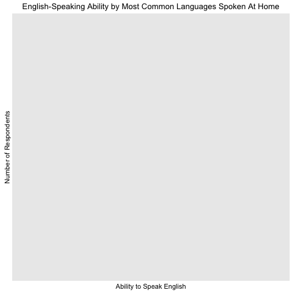

```{r}


```

##Setting up our Environment

First things first: we set up our environment to include all the packages and libraries needed for analysis.


```{r}
library(data.table)
library(dplyr)
library(googleVis)
op <- options(gvis.plot.tag='chart')
library(survey)
library(ggplot2)
library(plyr)
detach("package:plyr", unload=TRUE)
library(dplyr)
library(reshape)
library(plotrix)
library(RColorBrewer)
library(wordcloud)
library(tm)
library(SnowballC)
```

```{r}
source("lib/sri2116_functions.R")
population <- prepare_data()
states(population)

```
<p> </p>
```{r}
popular_languages(population)

```
<p> </p>
```{r}
common_languages(population)
```
<p> </p>
```{r}
common_states(population)
```
<p> </p>
```{r}
source("lib/jmd2228_functions.R")
pops <- prepare_data()
had_child_t_test(pops)
```

```{r, results='asis',tidy=FALSE}
  
  # Graph stacked bar charts
  plotframe <- data.frame(ability = c("Very Well", "Well", "Not Well", "Not at all"), child = c(prop.table(table(pops$children))), nochild = c(prop.table(table(pops$nochildren))))

  # Plot bar chart
  chart <- gvisColumnChart(plotframe, xvar="ability", yvar=c("child", "nochild"), options=list(isStacked=TRUE, title="Parents' Ability to Speak English Stacked By Birth of Child", vAxes="[{title:'Percent of Sub Population'}]", series="[{labelInLegend: 'Child'}, {labelInLegend: 'No child'}]"))
                           
  plot(chart)

```

```{r, results='asis',tidy=FALSE}
  #### Gathering data ####
  population2 <- fread("data/josh2.csv")
  #eng_speaking_countries <- fread("data/eng_speaking.csv")
  
  # Children's ability to speak english
  sub_pop_3 <- select(population2, ENG, NOP, NATIVITY, AGEP)
  sub_pop_3 <- subset(sub_pop_3, NATIVITY == 1 & AGEP <= 18)
  sub_pop_3 <- select(sub_pop_3, ENG, NOP)
  
  childframe <- data.frame(id = as.numeric(sub_pop_3$ENG), parent = as.numeric(sub_pop_3$NOP), childsize = c(rep(1,length(sub_pop_3$ENG))), fac = as.numeric(sub_pop_3$ENG))
  childframe <- na.omit(childframe)
  childframe <- aggregate(childframe$childsize, by=list(childframe$parent, childframe$id), sum)
  childframe <- data.frame(id = childframe$Group.2, parent = childframe$Group.1, childsize = childframe$x, fac = childframe$x)
  
  
  for(i in 1:dim(childframe)[1]){
    if (childframe$parent[i] == 1){
      childframe$parent[i] = "Both Native"
    } else if (childframe$parent[i] == 2){
      childframe$parent[i] = "Father Foreign"
    } else if (childframe$parent[i] == 3){
      childframe$parent[i] = "Mother Foreign"
    } else if (childframe$parent[i] == 4){
      childframe$parent[i] = "Both Foreign"
    } else if (childframe$parent[i] == 5){
      childframe$parent[i] = "Only Father, Native"
    } else if (childframe$parent[i] == 6){
      childframe$parent[i] = "Only Father, Foreign"
    } else if (childframe$parent[i] == 7){
      childframe$parent[i] = "Only Mother, Native"
    } else {
      childframe$parent[i] = "Only Mother, Foreign"
    }
    
    if (childframe$id[i] == 1){
      childframe$id[i] = paste("Very Well Count:", childframe$childsize[i])
    } else if (childframe$id[i] == 2){
      childframe$id[i] = paste("Well Count:", childframe$childsize[i])
    } else if (childframe$id[i] == 3){
      childframe$id[i] = paste("Not well Count:", childframe$childsize[i])
    } else {
      childframe$id[i] = paste("Not at all Count:", childframe$childsize[i])
    }
  }
  
  # Analysis Population 2
  childframe <- rbind(c("TOP",NA,10, 2), childframe)
  childframe <- rbind(c("Both Native","TOP",5, 4), childframe)
  childframe <- rbind(c("Father Foreign","TOP",5, 5), childframe)
  childframe <- rbind(c("Mother Foreign","TOP",5, 6), childframe)
  childframe <- rbind(c("Both Foreign","TOP",5, 7), childframe)
  childframe <- rbind(c("Only Father, Native","TOP",5, 8), childframe)
  childframe <- rbind(c("Only Father, Foreign","TOP",5, 9), childframe)
  childframe <- rbind(c("Only Mother, Native","TOP",5, 10), childframe)
  childframe <- rbind(c("Only Mother, Foreign","TOP",5, 11), childframe)
  childframe$id[36] = "Not at all Count: 9"
  
  tree <- gvisTreeMap(childframe,  idvar="id", parentvar="parent", sizevar="childsize", colorvar="fac", options=list(minColor='#EDF8FB',midColor='#66C2A4',maxColor='#006D2C'))
  plot(tree)
  
```

```{r}
source("lib/cj2452_functions.R")
population <- prepare_data()
Eng_Pie(population)
Time_Series(population)
Sex_Decades(population)
Age_Decades(population)
```

```{r}

```

